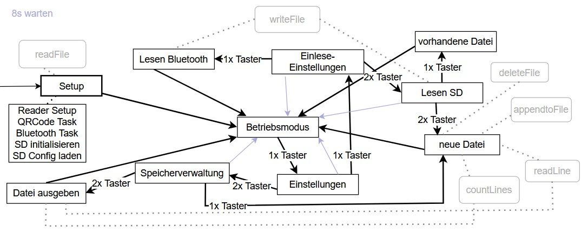

## Inhaltsverzeichnis
- [Einleitung](#einleitung)
- [Grafik](#grafik)
- [Funktionsweise der State Machine](#funktionsweise-der-state-machine)
- [Detaillierte Zustandsbeschreibung](#detaillierte-zustandsbeschreibung)
  - [Betriebsmodus](#betriebsmodus)
  - [Einstellungen](#einstellungen)
  - [Einlese-Einstellung](#einlese-einstellung)
  - [Lesen Bluetooth](#lesen-über-bluetooth)
  - [Lesen SD](#lesen-und-speichern-auf-sd-karte)
  - [vorhandene Datei](#speichern-in-vorhandene-datei)
  - [neue Datei](#neue-datei-erstellen)
  - [Speicherverwaltung](#speicherverwaltung)
  - [Datei ausgeben](#datei-ausgeben)
- [Aufgerufene Methoden - im Detail erklärt](#methoden)
  - [Fehlermeldungen](#fehlermeldungen)
  - [appendToFile()](#appendtofile)
  - [countLines()](#countlines)
  - [deleteFile()](#deletefile)
  - [readLine()](#readline)
  - [tasterTime()](#tastertime)
  - [typeText()](#typetext)
  - [writeFile()](#writefile)
  - [Dokumentation für FreeRTOS-Funktionen](#dokumentation-der-freertos-funktionen)
    - [vTaskDelay](#1-vtaskdelay)
    - [vTaskSuspend](#2-vtasksuspend)
    - [vTaskResume](#3-vtaskresume)


## Einleitung
Die State Machine auf dem ESP32 ermöglicht die Steuerung verschiedener Betriebsmodi. Die Implementierung als Zustandsmaschine erleichtert die Erweiterung um zusätzliche Zustände. Im Folgenden wird die Funktionsweise beschrieben, einschließlich detaillierter Erklärungen zu jedem Zustand, sowie die dabei aufgerufenen Funktionen und Tasks.

Um Daten für den Nutzer auszugeben wird die Datei [`typeText()`](#typetext) genutzt, da diese die Daten per Bluetooth überträgt und dann auf dem Gerät des Nutzers ausgibt. Um im Entwicklermodus die Daten auch lesen zu können wird dafür die Serial.println()-Methode genutzt, die die Texte über die serielle Schnittstelle ausgibt. Fehlermeldungen sind daher nur im Entwicklermodus sichtbar.

## Grafik


## Funktionsweise der State Machine
Die Zustandsmaschine basiert auf einer Endlosschleife, in der der aktuelle Zustand ausgewertet wird. Mithilfe eines `switch`-Statements werden die Zustandsfunktionen aufgerufen, die spezifische Aufgaben ausführen und Übergänge zwischen den Zuständen definieren.
```cpp
void state_machine(void *pvParameters) {
  while(true) {
    switch(zustand) {
      case Z_BETRIEBS_MODUS : betriebs_modus(); break;
      case Z_EINSTELLUNGEN : einstellung(); break;
      case Z_EINLESE_EINSTELLUNG : einleseEinstellung(); break;
      case Z_LESEN_BLUETOOTH : lesenBluetooth(); break;
      case Z_LESEN_SD : lesenSD(); break;
      case Z_VORHANDENE_DATEI : vorhandeneDatei(); break;
      case Z_NEUE_DATEI : neueDatei(); break;
      case Z_SPEICHERVERWALTUNG : speicherverwaltung(); break;
      case Z_DATEI_AUSGEBEN : dateiAusgeben(); break;
      default: fehler_in_state_machine();
    }
  }
}
```


## Detaillierte Zustandsbeschreibung
### Betriebsmodus
Der Betriebsmodus ist der Standardzustand der Zustandsmaschine. In diesem Zustand ist der QR-Code-Leser aktiv und verarbeitet eingehende QR-Codes.
##### Funktionsweise
1. **Aktivierung des QR-Code-Lesers**: Es wird überprüft, ob der QR-Code-Leser pausiert wurde (z. B. im Einstellungsmodus um Rechen-Ressourcen zu sparen). Falls ja, wird der Leser wieder aktiviert.
2. **Tastereingaben für die Auswahl**:
    - **1x Tasterdruck**: Wechsel in den Zustand [`Z_EINSTELLUNGEN`](#einstellungen)
    - **Kein Tasterdruck**: Geht erneut in den Zustand `Z_BETRIEBS_MODUS`
##### Verhalten bei Rückkehr in diesen Zustand
Nach dem Abschluss anderer Zustände (z. B. Einstellungen oder Speicherverwaltung) kehrt die Zustandsmaschine automatisch in den Betriebsmodus zurück. Hierbei wird sichergestellt, dass der QR-Code-Leser wieder aktiviert ist und auf neue Eingaben wartet.
##### Code
```cpp
void betriebs_modus()
{
  //Starte QR-Code leser, falls er zuvor pausiert wurde
  if(zustand_alt != Z_BETRIEBS_MODUS && QR_Code_Handel != NULL)
  {
    vTaskResume(QR_Code_Handel);
  }
  
  tasterTime(30000);
  
  // Überprüfen der Tastereingaben
  if(tasterDruck == 1)
  {
    // Wechsel in den Einstellungsmodus
    zustand_alt = zustand;
    zustand = Z_EINSTELLUNGEN;
  } else {
    // Keine Aktion, bleibt im Betriebsmodus
    zustand_alt = zustand;
  }
}
```


### Einstellungen

Der Zustand `Z_EINSTELLUNGEN` ermöglicht es dem Nutzer, grundlegende Konfigurationen vorzunehmen. Dieser Zustand dient als zentrale Auswahlmöglichkeit für die Modi Einlese-Einstellung oder die Speicherverwaltung.

##### Funktionsweise

1. **Deaktivierung des QR-Code-Lesers**: Wenn der Zustand aus dem Betriebsmodus aufgerufen wird, wird der QR-Code-Leser angehalten, um ungestört Einstellungen vornehmen zu können und Rechen-Ressourcen zu sparen.
2. **Anzeige von Optionen**: Der Nutzer wird über verfügbare Einstellungen informiert, indem entsprechende Texte ausgegeben werden. Danach wird ihm die Möglichkeit gegeben innerhalb von 8 Sekunden per Tastendruck zu reagieren.
3. **Tastereingaben für die Auswahl**:
    - **1x Tasterdruck**: Wechsel in den Zustand [`Z_EINLESE_EINSTELLUNG`](#einlese-einstellung)
    - **2x Tasterdruck**: Wechsel in den Zustand [`Z_SPEICHERVERWALTUNG`](#speicherverwaltung)
    - **Kein Tasterdruck**: Rückkehr in den Zustand [`Z_BETRIEBS_MODUS`](#betriebsmodus)


##### Code

```cpp
void einstellung()
{
  //QR-Code Leser Stoppen.
  if(zustand_alt == Z_BETRIEBS_MODUS && QR_Code_Handel != NULL)
  {
    vTaskSuspend(QR_Code_Handel);
  }

  //Ausgabe des Menüs:
  typeText("\nEinstellungen:");
  vTaskDelay( Delay100 );
  typeText("\n1x Taster: Einlese-");
  vTaskDelay( Delay100 );
  typeText("Einstellung");
  vTaskDelay( Delay100 );
  typeText("\n2x Taster: ");
  vTaskDelay( Delay100 );
  typeText("Speicherverwaltung\n");
  vTaskDelay( Delay100 );
  tasterTime(8000);

  // Tastereingaben auswerten
  if(tasterDruck == 1)
  {
    // Wechsel in den Einlese-Einstellungsmodus
    zustand_alt = zustand;
    zustand = Z_EINLESE_EINSTELLUNG;
  }else if(tasterDruck == 2)
  {
    // Wechsel in die Speicherverwaltung
    zustand_alt = zustand;
    zustand = Z_SPEICHERVERWALTUNG;
  }else
  {
    // Keine Eingabe, Rückkehr in den Betriebsmodus
    zustand_alt = zustand;
    zustand = Z_BETRIEBS_MODUS;
  }
}
```

### Einlese-Einstellung

Der Zustand `Z_EINLESE_EINSTELLUNG` ermöglicht es dem Nutzer, den bevorzugten Modus für die Verarbeitung eingelesener QR-Codes auszuwählen. Die Optionen umfassen die Übertragung per Bluetooth oder das Speichern der Daten auf einer SD-Karte.

##### Funktionsweise

1. **Anzeige von Optionen**: Der Nutzer wird durch Textausgaben über die verfügbaren Einlesemodi informiert:
    - Übertragung eingelesener QR-Codes per Bluetooth.
    - Speicherung eingelesener QR-Codes auf der SD-Karte.
2. **Tastereingaben für die Auswahl**:
    - **1x Tasterdruck**: Wechsel in den Zustand [`Z_LESEN_BLUETOOTH`](#lesen-über-bluetooth)
    - **2x Tasterdruck**: Wechsel in den Zustand [`Z_LESEN_SD`](#lesen-über-bluetooth)
    - **Kein Tasterdruck**: Rückkehr in den Zustand [`Z_BETRIEBS_MODUS`](#betriebsmodus)

##### Code

```cpp
void einleseEinstellung()
{
  //Ausgabe des Menüs:
  typeText("\nEinlese-Einstellung:");
  vTaskDelay( Delay100 );
  typeText("\n1x Taster: Eingelesener ");
  vTaskDelay( Delay100 );
  typeText("QR-Code direkt per ");
  vTaskDelay( Delay100 );
  typeText("Bluetooth");
  vTaskDelay( Delay100 );
  typeText(" übermitteln.");
  vTaskDelay( Delay100 );
  typeText("\n2x Taster: ");
  vTaskDelay( Delay100 );
  typeText("Eingelesener QR-Code auf");
  vTaskDelay( Delay100 );
  typeText(" SD-Karte speichern.\n");
  vTaskDelay( Delay100 );

  DEBUG_PRINTLN("Einlese-Einstellung:\n1x Taster: Eingelesener QR-Code direckt per Bluetooth übertragen.\n2x Taster: Eingelesener QR-Code auf SD-Karte speichern.");

  tasterTime(8000);

  // Tastereingaben auswerten
  if(tasterDruck == 1)
  {
    // Wechsel in den Bluetooth-Modus
    zustand_alt = zustand;
    zustand = Z_LESEN_BLUETOOTH;
  }else if(tasterDruck == 2)
  {
    // Wechsel in den SD-Karten-Modus
    zustand_alt = zustand;
    zustand = Z_LESEN_SD;
  }else
  {
    // Keine Eingabe, Rückkehr in den Betriebsmodus
    zustand_alt = zustand;
    zustand = Z_BETRIEBS_MODUS;
  }
}
```

### Lesen über Bluetooth

Der Zustand `Z_LESEN_BLUETOOTH` stellt den Modus ein, in dem eingelesene QR-Codes direkt über Bluetooth an ein verbundenes Gerät übertragen werden.

##### Funktionsweise

1. **Anzeige der Einstellung**:
    - Es wird dem Nutzer mitgeteilt, dass der Modus "Lesen über Bluetooth" aktiviert wurde.
2. **Konfiguration speichern**:
    - Die Konfiguration wird angepasst, indem der Wert `0` in der Konfigurationsdatei `/config/config.txt` gespeichert wird. Dies wird intern benötigt um zu speichern, dass Bluetooth als Übertragungsmodus aktiv ist.
    - Falls der Modus bereits auf Bluetooth eingestellt ist, wird keine Änderung vorgenommen.
3. **Rückkehr in den Betriebsmodus**:
    - Nach der Anpassung der Konfiguration wechselt die Zustandsmaschine automatisch zurück in den Zustand [`Z_BETRIEBS_MODUS`](#betriebsmodus).

##### Code

```cpp
void lesenBluetooth()
{
  typeText("\nDer Modus: ");
  vTaskDelay( Delay100 );
  typeText("Eingelesener ");
  vTaskDelay( Delay100 );
  typeText("QR-Code direkt per ");
  vTaskDelay( Delay100 );
  typeText("Bluetooth");
  vTaskDelay( Delay100 );
  typeText(" übermitteln ");
  vTaskDelay( Delay100 );
  typeText("wurde eingestellt.\n");
  vTaskDelay( Delay100 );
  DEBUG_PRINTLN("Der Modus: Eingelesener QR-Code direckt per Bluetooth übertragen wurde eingestellt.");

  //Config anpassen
  if(config != 0){
    config = 0;
    writeFile(SD_MMC, "/config/config.txt", "0");
  }

  // Rückkehr in den Betriebsmodus
  zustand_alt = zustand;
  zustand = Z_BETRIEBS_MODUS;
}
```

### Lesen und Speichern auf SD-Karte

Im Zustand `Z_LESEN_SD` werden eingelesene QR-Codes auf einer SD-Karte gespeichert. Der Nutzer wählen, ob die QR-Codes in einer vorhandenen Datei oder in einer neuen Datei gespeichert werden sollen.

##### Funktionsweise

1. **Anzeige der Einstellung**:
    - Der Nutzer wird darüber informiert, dass der Modus "Lesen auf SD-Karte" aktiviert wurde.
2. **Konfiguration speichern**:
    - Die Konfiguration wird angepasst, indem der Wert `1` in der Konfigurationsdatei `/config/config.txt` gespeichert wird. Dies wird intern benötigt um zu speichern, dass QR-Codes nun auf der SD-Karte gespeichert werden.
    - Falls der Modus bereits auf SD-Karte eingestellt ist, wird keine Änderung vorgenommen.
3. **Auswahl des Speicherorts**:
    - Der Nutzer kann auswählen, ob eine neue Datei für die Speicherung der QR-Codes erstellt oder die vorhandene aktuelle Datei genommen werden soll:
        - **1x Tasterdruck**:  Wechsel in den Zustand [`Z_VORHANDENE_DATEI`](#speichern-in-vorhandene-datei)
        - **2x Tasterdruck**:  Wechsel in den Zustand [`Z_NEUE_DATEI`](#neue-datei-erstellen)
        - **Kein Tasterdruck**: Rückkehr in den Zustand [`Z_BETRIEBS_MODUS`](#betriebsmodus)

##### Code

```cpp
void lesenSD()
{
  typeText("\nDer Modus: ");
  vTaskDelay( Delay100 );
  typeText("Eingelesener QR-Code ");
  vTaskDelay( Delay100 );
  typeText("auf SD-Karte speichern ");
  vTaskDelay( Delay100 );
  typeText("wurde eingestellt.\n");
  vTaskDelay( Delay100 );
  DEBUG_PRINTLN("Der Modus: Eingelesener QR-Code auf SD-Karte speichern wurde eingestellt.");
  
  //Config anpassen
  if(config != 1){
    config = 1;
    writeFile(SD_MMC, "/config/config.txt", "1");
  }
  
  //Ausgabe des Menüs:
  typeText("\nLesen auf SD-Karte:");
  vTaskDelay( Delay100 );
  typeText("\n1x Taster: In ");
  vTaskDelay( Delay100 );
  typeText("vorhandene Datei speichern.");
  vTaskDelay( Delay100 );
  typeText("\n2x Taster: Neue ");
  vTaskDelay( Delay100 );
  typeText("Datei anlegen in ");
  vTaskDelay( Delay100 );
  typeText("die die QR-Codes ");
  vTaskDelay( Delay100 );
  typeText("gespeichert werden.\n");
  vTaskDelay( Delay100 );
  DEBUG_PRINTLN("Lesen auf SD-Karte:\n1x Taster: In vorhandene Datei speichern.\n2x Taster: Neue Datei anlegen in die die QR-Codes gespeichert werden.");

  tasterTime(8000);
  
  // Auswerten der Nutzereingabe
  if(tasterDruck == 1)
  {
    //Wechsel in den Vorhandene-Datei-Modus
    zustand_alt = zustand;
    zustand = Z_VORHANDENE_DATEI;
  }else if(tasterDruck == 2)
  {
    //Wechseln in den Neuen-Datei-Modus
    zustand_alt = zustand;
    zustand = Z_NEUE_DATEI;
  }else
  {
    // Keine Eingabe, Rückkehr in den Betriebsmodus
    zustand_alt = zustand;
    zustand = Z_BETRIEBS_MODUS;
  }
}
```


### Speichern in vorhandene Datei

Im Zustand `Z_VORHANDENE_DATEI` wird der QR-Code-Leser so konfiguriert, dass eingelesene QR-Codes in eine bereits vorhandene Datei auf der SD-Karte gespeichert werden.

##### Funktionsweise

1. **Anzeige der Auswahl**:
    - Der Nutzer wird darüber informiert, dass die QR-Codes in einer vorhandenen Datei gespeichert werden.
2. **Übergang in den Betriebsmodus**:
    - Nach der Ausgabe wird automatisch wieder in den Betriebsmodus ([`Z_BETRIEBS_MODUS`](#betriebsmodus)) gewechselt, um den QR-Code-Leser für neue Eingaben zu aktivieren und einzulesen.

##### Code

```cpp
void vorhandeneDatei()
{
  typeText("\nWird in ");
  vTaskDelay( Delay100 );
  typeText("vorhandener Datei ");
  vTaskDelay( Delay100 );
  typeText("gespeichert.\n");
  vTaskDelay( Delay100 );
  DEBUG_PRINTLN("Wird in vorhandener Datei gespeichert.");

  // Übergang in den Betriebsmodus
  zustand_alt = zustand;
  zustand = Z_BETRIEBS_MODUS;
}
```


### Neue Datei erstellen

Im Zustand `Z_NEUE_DATEI` wird eine neue Datei erstellt, in die zukünftig eingelesene QR-Codes gespeichert werden. Dieser Modus bietet die Möglichkeit, bestehende Daten zu archivieren und einen neuen Speicherplatz für QR-Codes bereitzustellen.

##### Funktionsweise

1. **Überprüfung und Initialisierung**:
    - Der Zähler `letztesArchiv` wird überprüft, um sicherzustellen, dass die Dateinummerierung nicht überschritten wird. Falls nötig, wird der Zähler zurückgesetzt.
2. **Archivierung der aktuellen Datei**:
    - Eine neue Datei wird im Verzeichnis `/archiv/` mit einem Namen basierend auf `letztesArchiv` erstellt (z. B. `1.txt`, `2.txt`, ...).
    - Alle bestehenden Einträge aus der Datei `/aktuellQR.txt` werden in die neue Datei unter Nutzung der Methoden [`countLines()`](#countlines) und [`appendToFile()`](#appendtofile) kopiert.
3. **Konfiguration und Bereitstellung der neuen Datei**:
    - Der neue Wert von `letztesArchiv` wird in der Konfigurationsdatei auf der SD-Karte gespeichert.
    - Die Datei `/aktuellQR.txt` wird geleert (mithilfe der Methoden [`deleteFile()`](#deletefile) gelöscht und mit [`writeFile()`](#writefile) eine neue Datei mit dem gleichen Namen erstellt) und steht wieder für neue QR-Codes bereit.
4. **Übergang in den Betriebsmodus**:
    - Nach Abschluss der Dateioperationen wird in den Betriebsmodus ([`Z_BETRIEBS_MODUS`](#betriebsmodus)) zurück gewechselt.

##### Code

```cpp
void neueDatei()
{
  if(letztesArchiv+1>1000000)
  {
    letztesArchiv = 0;
  }

  //Neue Datei anlegen.
  String pfad2 = String(++letztesArchiv) + ".txt";
  String pfad = "/archiv/" + pfad2;
  String inhalt = "";
  int zeilenAnzahl = countLines(SD_MMC, "/aktuellQR.txt");

  //Jede Zeile einzelt in neue Datei schreiben
  for(int i = 1; i <= zeilenAnzahl; i++)
  {
    inhalt = readLine(SD_MMC, "/aktuellQR.txt", i) + "\n";
    vTaskDelay(200 / portTICK_PERIOD_MS);
    appendToFile(SD_MMC, pfad.c_str(), inhalt.c_str());
    vTaskDelay(200 / portTICK_PERIOD_MS);
  }
  
  // Konfiguration aktualisieren und Bereinigung
  vTaskDelay( 200 / portTICK_PERIOD_MS );
  writeFile(SD_MMC, "/config/letztesArchiv.txt", String(letztesArchiv).c_str());     
  //Vorhandene Archivnummer in Config anpassen.
  vTaskDelay( 100 / portTICK_PERIOD_MS );

  //Löschen der Eingelesenen QR-Codes in aktuellQR.txt
  deleteFile(SD_MMC, "/aktuellQR.txt");
  vTaskDelay( 100 / portTICK_PERIOD_MS );
  writeFile(SD_MMC, "/aktuellQR.txt", "");
  vTaskDelay( 100 / portTICK_PERIOD_MS );

  typeText("\nNeue Datei ");
  vTaskDelay( Delay100 );
  typeText("wird angelegt.\n");
  vTaskDelay( Delay100 );
  DEBUG_PRINTLN("Neue Datei wird angelegt.");

  // Übergang in den Betriebsmodus
  zustand_alt = zustand;
  zustand = Z_BETRIEBS_MODUS;
}
```

### Speicherverwaltung

Der Zustand `Z_SPEICHERVERWALTUNG` ermöglicht dem Nutzer die Auswahl zwischen dem Anlegen einer neuen Datei oder dem Ausgeben des Inhalts der aktuellen Datei.

##### Funktionsweise

1. **Anzeige der Auswahl**:
    - Der Nutzer kann auswählen, ob die aktuelle Datei ausgegeben oder eine neue Datei erstellt werden soll.
2. **Benutzerauswahl**:
    - Der Nutzer wird aufgefordert, durch Tastereingaben eine Aktion auszuwählen:
        - **1x Tasterdruck**: Wechsel in den Zustand [`Z_NEUE_DATEI`](#neue-datei-erstellen)
        - **2x Tasterdruck**: Wechsel in den Zustand [`Z_DATEI_AUSGEBEN`](#datei-ausgeben)
        - **Kein Tasterdruck**: Rückkehr in den Zustand [`Z_BETRIEBS_MODUS`](#betriebsmodus)

##### Code

```cpp
void speicherverwaltung()
{
  typeText("\nSpeicherverwaltung:");
  vTaskDelay( Delay100 );
  typeText("\n1x Taster: Neue ");
  vTaskDelay( Delay100 );
  typeText("Datei anlegen\n");
  vTaskDelay( Delay100 );
  typeText("2x Taster: Inhalt");
  vTaskDelay( Delay100 );
  typeText(" aus aktueller ");
  vTaskDelay( Delay100 );
  typeText("Datei ausgeben.\n");
  vTaskDelay( Delay100 );
  DEBUG_PRINTLN("Speicherverwaltung:\n1x Taster: Neue Datei anlegen- \n2x Taster: Inhalt aus aktueller Datei ausgeben.");

  tasterTime(8000);
  
  // Auswerten der Nutzereingabe
  if(tasterDruck == 1)
  {
    //Wechsel in den Neue-Datei-Modus
    zustand_alt = zustand;
    zustand = Z_NEUE_DATEI;
  }else if(tasterDruck == 2)
  {
    //Wechseln in den Datei-Ausgabe-Modus
    zustand_alt = zustand;
    zustand = Z_DATEI_AUSGEBEN;
  }else
  {
    // Keine Eingabe, Rückkehr in den Betriebsmodus
    zustand_alt = zustand;
    zustand = Z_BETRIEBS_MODUS;
  }
}
```

### Datei Ausgeben 

Der Zustand `Z_DATEI_AUSGEBEN` dient dazu, den Inhalt der aktuell gespeicherten Datei auszugeben. Der Benutzer muss den Taster betätigen, um die Ausgabe zu starten.

##### Funktionsweise

1. **Benutzerauswahl**:
    - Der Nutzer hat 10 Sekunden Zeit, um den Taster zu betätigen, damit der Inhalt ausgegeben wird.
    - Dann wird der Inhalt der Datei unter Nutzung der Methode [`countLines()`](#countlines) aus der Datei `/aktuellQR.txt` zeilenweise ausgelesen und ausgegeben.
2. **Anzeige des Inhalts**:
    - Jede Zeile wird einzeln per Bluetooth übermittelt und ausgegeben.
3. **Timeout**:
    - Falls der Nutzer in den 10 Sekunden keine Eingabe macht, kehrt das System automatisch in den Betriebsmodus ([`Z_BETRIEBS_MODUS`](#betriebsmodus)) zurück.


##### Code

```cpp
void dateiAusgeben()
{
  typeText("\nDer Inhalt ");
  vTaskDelay( Delay100 );
  typeText("der Datei wird ");
  vTaskDelay( Delay100 );
  typeText("ausgegeben sobald ");
  vTaskDelay( Delay100 );
  typeText("1x auf den Taster");
  vTaskDelay( Delay100 );
  typeText(" gedrückt wird. (");
  vTaskDelay( Delay100 );
  typeText("In den nächsten ");
  vTaskDelay( Delay100 );
  typeText("10 Sekunden)\n");
  vTaskDelay( Delay100 );
  DEBUG_PRINTLN("Der Inhalt der Datei wird ausgegeben sobald sie 1x auf den Taster drücken. (In den nächsten 10 Sekunden)");

  tasterTime(10000);
  
  String inhalt = "";
  int zeilenAnzahl = countLines(SD_MMC, "/aktuellQR.txt");

  if(tasterDruck == 1)
  {
    //Die Datei wird Zeilenweise per Bluetooth ausgegeben.
    for(int i = 1; i <= zeilenAnzahl; i++)
    {
      inhalt = readLine(SD_MMC, "/aktuellQR.txt", i) + "\n";
      typeText(inhalt.c_str());
      vTaskDelay(300 / portTICK_PERIOD_MS);
    }
  }
  
  // Rückkehr in den Betriebsmodus
  zustand_alt = zustand;
  zustand = Z_BETRIEBS_MODUS;
}
```


## Methoden
### Fehlermeldungen
**Alle Fehlermeldungen werden nur im Entwicklermodus sichtbar, da sie über die serielle Schnittstelle ausgegeben werden!** Sie werden hier trotzdem aufgeführt um die Konsequenzen in einem Fehlerfall zu zeigen.

### appendToFile

##### Beschreibung

Die Methode `appendToFile()` ermöglicht das Anhängen eines Textes an eine bestehende Datei auf einer SD-Karte. Sie wird im Zustand [`Z_NEUE_DATEI`](#neue-datei-erstellen) verwendet, um die Daten der Datei, in die aktuell geschrieben wird, in eine neue Archiv-Datei zu verschieben.

##### Funktionsdefinition

```cpp
void appendToFile(fs::FS &fs, const char *path, const char *message);
```

##### Parameter

- `fs::FS &fs`: Das Dateisystem-Objekt, welches die SD-Karte repräsentiert (z. B. `SD_MMC`)
- `const char *path`: Der Pfad der Datei auf der SD-Karte, an die der Text angehängt werden soll
- `const char *message`: Der anzuhängende Text

##### Ablauf

1. Die Methode versucht die angegebene Datei zu öffnen.
2. Kann die Datei nicht geöffnet werden, wird eine Fehlermeldung ausgegeben, und die Methode beendet sich ohne Änderungen an der Datei.
3. Gelingt das Öffnen, wird der angegebene Text (`message`) an das Ende der Datei geschrieben.
4. Je nach Erfolg oder Fehler beim Anhängen wird eine Statusmeldung ausgegeben:
    - Erfolgreiches Anhängen: "Daten erfolgreich angehängt!"
    - Fehler beim Schreiben: "Fehler beim Anhängen an die Datei!"
5. Die Datei wird am Ende stets geschlossen, um sicherzustellen, dass keine Ressourcen offengelassen werden.

### countLines

##### Beschreibung

Die Methode `countLines()` zählt die Anzahl der Zeilen in einer Datei auf einer SD-Karte. Die Anzahl wird benötigt wenn im Zustand [`Z_NEUE_DATEI`](#neue-datei-erstellen) Daten in eine andere Datei kopiert werden oder zeilenweise eine Text-Datei im Zustand [`Z_DATEI_AUSGEBEN`](#datei-ausgeben) ausgelesen wird.

##### Funktionsdefinition

```cpp
int countLines(fs::FS &fs, const char *path);
```

##### Parameter

- `fs::FS &fs`: Das Dateisystem-Objekt, welches die SD-Karte repräsentiert (z. B. `SD_MMC`)
- `const char *path`: Der Pfad der Datei auf der SD-Karte, deren Zeilen gezählt werden sollen

#### Ablauf

1. Die Methode öffnet die angegebene Datei im Lesemodus.
2. Kann die Datei nicht geöffnet werden, wird im Entwicklermodus eine Fehlermeldung ausgegeben, und die Methode gibt den Wert `-1` zurück.
3. Ist die Datei erfolgreich geöffnet, wird ihr Inhalt Zeichen für Zeichen gelesen. Jedes Vorkommen des Zeichens `'\n'` (Zeilenumbruch) wird als neue Zeile gezählt.
4. Nachdem der gesamte Inhalt gelesen wurde, wird die Datei geschlossen.
5. Die Anzahl der gezählten Zeilen wird im Entwicklermodus ausgegeben und als Rückgabewert zurückgegeben.

##### Rückgabe

- `int`:
    - Die Anzahl der Zeilen in der Datei
    - `-1`, falls die Datei nicht geöffnet werden konnte

### deleteFile

##### Beschreibung

Die Methode `deleteFile()` entfernt eine Datei auf der SD-Karte. Dies wird im Zustand [`Z_NEUE_DATEI`](#neue-datei-erstellen) benötigt um nach dem Kopieren der Daten in eine Datei im Archiv die aktuellen Daten zu löschen um den Dateinamen wieder zum Schreiben der Codes nutzen zu können.

##### Funktionsdefinition

```cpp
void deleteFile(fs::FS &fs, const char *path);
```

##### Parameter

- `fs::FS &fs`: Das Dateisystem-Objekt, das die SD-Karte repräsentiert (z. B. `SD_MMC`)
- `const char *path`: Der Pfad der Datei, die gelöscht werden soll

##### Ablauf

1. Die Methode versucht, die Datei unter dem angegebenen Pfad mithilfe der Funktion `fs.remove()` zu löschen.
2. Erfolgreiches Löschen der Datei wird im Entwicklermodus über die serielle Schnittstelle bestätigt.
3. Falls das Löschen fehlschlägt (z. B. weil die Datei nicht existiert oder keine Berechtigung vorliegt), wird im Entwicklermodus eine Fehlermeldung ausgegeben.

### readLine

##### Beschreibung

Die Methode `readLine()` liest eine bestimmte Zeile aus einer Datei auf der SD-Karte und gibt deren Inhalt als `String` zurück. Dies wird im Zustand [`Z_NEUE_DATEI`](#neue-datei-erstellen) [`Z_DATEI_AUSGEBEN`](#datei-ausgeben) benötigt, um die Daten in eine neue Datei zu kopieren oder um sie danach auszugeben. Die Methode wird dabei aus for-Schleifen aufgerufen, wodurch die Zeilennummer von 1 bis zur Anzahl der Zeilen (mit [`countLines()`](#countlines) bestimmt) hochzählt. Dadurch werden nacheinander die Daten aller Zeilen zurückgegeben.

##### Funktionsdefinition

```cpp
String readLine(fs::FS &fs, const char *path, int lineNumber);
```

##### Parameter

- `fs::FS &fs`: Das Dateisystem-Objekt, das die SD-Karte repräsentiert (z. B. `SD_MMC`)
- `const char *path`: Der Pfad der Datei, aus der die Zeile gelesen werden soll
- `int lineNumber`: Die Nummer der Zeile, die gelesen werden soll

##### Ablauf

1. Die Methode öffnet die Datei im Lesemodus.
2. Die Datei wird zeichenweise gelesen, wobei Zeilenumbrüche (`\n`) verwendet werden, um Zeilen zu erkennen.
3. Der Inhalt der gewünschten Zeile wird gesammelt, bis der nächste Zeilenumbruch erreicht ist.
4. Wenn die gewünschte Zeile vollständig gelesen wurde, wird sie zurückgegeben.
5. Falls die Datei nicht geöffnet werden kann oder die Zeilennummer die Gesamtzeilenanzahl der Datei überschreitet, wird ein leerer String (`""`) zurückgegeben und im Entwicklermodus eine Fehlermeldung ausgegeben.

##### Rückgabewert

- `String`: Der Inhalt der angeforderten Zeile
- Falls die Zeile nicht gefunden wird, wird ein leerer String zurückgegeben.

### tasterTime

##### Beschreibung

Die Methode `tasterTime()` überwacht für eine bestimmte Zeit einen Taster-Eingang und zählt, wie oft der Taster innerhalb dieses Zeitraums gedrückt wird. Dies wird für alle Zustände gebraucht, die eine Reaktion/Eingabe des Nutzers über den Taster erwarten.

##### Funktionsdefinition

```cpp
void tasterTime(int startTime);
```

##### Parameter

- `int startTime`: Die maximale Zeitspanne (in Millisekunden), in der Tastereingaben überwacht werden sollen.

##### Ablauf

1. Die Variable `tasterDruck` wird auf `0` gesetzt, um sicherzustellen, dass vor der Messung keine alten Werte übernommen werden.
2. Eine Schleife läuft für die angegebene Zeit (`startTime`) oder bis der Taster das erste mal betätigt wird.
3. Während dieser Schleife wird der Zustand des Tasters überwacht:
    - Bei einem Tastendruck (`digitalRead(PIN_TASTER_LED) == LOW`) wird der Zähler `tasterDruck` inkrementiert.
    - Die Schleife wartet, bis der Taster wieder losgelassen wird, bevor sie fortfährt.
    - Nach einem Druck wird der verbleibende Zeitrahmen auf 1 Sekunde (`1000 ms`) gesetzt, um weitere Drücke innerhalb eines kurzen Zeitfensters zuerfassen.
4. Die Methode pausiert auch kurz (`Delay100`) zwischen den Iterationen, um die CPU-Auslastung zu minimieren.

##### Rückgabewert

Die Methode gibt keine direkten Werte zurück, beeinflusst jedoch die globale Variable `tasterDruck`, die die Anzahl der registrierten Tasterdrücke speichert.

### typeText

##### Beschreibung

Die Funktion `typeText()` simuliert das Eingeben eines Textes über eine virtuelle Tastatur. Dabei wird jedes Zeichen des Textes in entsprechende Tasteneingaben übersetzt und über eine Bluetooth Verbindung gesendet. Die Methode wird in den meisten Zuständen benötigt um den Nutzer durch die Einstellungen per Ausgabe der Modi-Möglichkeiten navigieren zu können.

##### Funktionsdefinition

```cpp
void typeText(const char* text);
```

##### Parameter

- `const char* text`: Ein Pointer auf ein Char Array, der den Text enthält, der durch die Methode per Bluetooth versendet werden soll.

##### Ablauf

1. Die Länge des übergebenen Textes wird ermittelt, und die Schleife iteriert über jedes Zeichen im Text.
2. Für jedes Zeichen wird:
    - Der ASCII-Wert des Zeichens (`text[i]`) ermittelt.
    - Der ASCII-Wert in eine entsprechende Tastenkombination übersetzt, basierend auf einer vordefinierten Tastenzuordnung (`keymap`).
    - Ein Eingabereport (`InputReport`) erstellt, der die gedrückten Tasten und Modifikatoren (z. B. Shift) beschreibt.
    - Der Eingabereport über die Bluetooth-Schnittstelle (`input->notify()`) gesendet.
3. Nach jeder Eingabe wird ein kurzer Delay eingefügt und ein "Tasten-loslassen"-Signal (`NO_KEY_PRESSED`) gesendet, um sicherzustellen, dass aufeinanderfolgende gleiche Zeichen nicht als eine einzige Eingabe interpretiert werden.
4. Der Prozess wiederholt sich für jedes Zeichen im Text.

##### Rückgabewert

Die Funktion gibt keinen direkten Rückgabewert zurück. Sie sendet jedoch die Tasteneingaben über die Bluetooth-Schnittstelle an das verbundene Gerät.


### writeFile()

##### Beschreibung  
Die Funktion `writeFile()` erstellt eine neue Datei oder überschreibt eine bestehende Datei und schreibt den angegebenen Textinhalt in diese. Sie wird unter anderem verwendet, um Daten dauerhaft auf der SD-Karte abzulegen:  Die Methode wird in den Zuständen [`Z_LESEN_BLUETOOTH`](#lesen-über-bluetooth) und [`Z_LESEN_SD`](#lesen-und-speichern-auf-sd-karte) benötigt um in der Konfigurationsdatei zu speichern/zu ändern in welchem Übertragungsmodus sich befunden wird. Im Zustand [`Z_NEUE_DATEI`](#neue-datei-erstellen) wird sie ebenfalls zur Konfigurationspeicherung, aber auch zum Erstellen einer neuen Datei gebraucht.

##### Funktionsdefinition

```cpp
void writeFile(fs::FS &fs, const char *path, const char *message);
```

##### Parameter

- `fs`: Referenz auf das Filesystem-Objekt (z. B. `SD` für die SD-Karten-Schnittstelle)
- `path`: Der Pfad zur Datei, in die geschrieben werden soll (z. B. `/data.txt`)
- `message`: Der Text, der in die Datei geschrieben werden soll

##### Ablauf

1. Datei öffnen: Die Datei wird im Schreibmodus geöffnet.
    - Existiert die Datei nicht, wird sie erstellt.
    - Existiert die Datei bereits, wird ihr Inhalt überschrieben.
2. Inhalt schreiben: Der Textinhalt von `message` wird in die Datei geschrieben.
3. Fehlerbehandlung:
    - Falls die Datei nicht geöffnet werden kann, wird eine Fehlermeldung ausgegeben.
    - Falls das Schreiben fehlschlägt, erfolgt ebenfalls eine Fehlermeldung.
4. Ressourcen freigeben: Die Datei wird nach Abschluss der Operation geschlossen.


### Dokumentation der FreeRTOS-Funktionen

#### 1. vTaskDelay

##### Beschreibung 
Die Funktion `vTaskDelay()` unterbricht die Ausführung der aktuellen Task für eine bestimmte Anzahl von Ticks und ermöglicht es anderen Tasks, ausgeführt zu werden.

##### Funktionsdefinition

```cpp
void vTaskDelay(const TickType_t xTicksToDelay);
```

##### Parameter

- `xTicksToDelay`: Die Anzahl der Ticks, für die die aktuelle Task verzögert werden soll. Der Wert hängt von der Tick-Rate des FreeRTOS-Kernels ab, definiert durch `configTICK_RATE_HZ`.

##### Eigenschaften

- Die Task wechselt in den Zustand "Blocked" und bleibt dort für die angegebene Zeit.
- Nach Ablauf der Verzögerung wird die Task wieder zur Ausführung bereit.

---

#### 2. vTaskSuspend

##### Beschreibung  
Die Funktion `vTaskSuspend()` setzt die angegebene Task in den Zustand "Suspended" (angehalten), wodurch sie nicht mehr zur Ausführung bereit ist, bis sie mit [`vTaskResume()`](#3-vtaskresume) wieder aktiviert wird. Dies wird im Zustand [`Z_EINSTELLUNGEN`](#einstellungen) benötigt, um Ressourcen zu sparen und während dem Navigieren in den Einstellungen die Verarbeitung der QR-Codes anzuhalten.

##### Funktionsdefinition

```cpp
void vTaskSuspend(TaskHandle_t xTaskToSuspend);
```

##### Parameter

- `xTaskToSuspend`: Der Handle der Task, die angehalten werden soll. Dieser wird bei der Erstellung der Task mit `xTaskCreate()` zurückgegeben.

##### Eigenschaften

- Die angehaltene Task bleibt im "Suspended"-Zustand, unabhängig von Ereignissen oder Zeitabläufen.

---

#### 3. vTaskResume

##### Beschreibung 
Die Funktion `vTaskResume()` weckt eine zuvor mit [`vTaskSuspend()`](#2-vtasksuspend) angehaltene Task wieder auf. Die Task wechselt dadurch in den Zustand "Ready" (bereit). Dies wird im Zustand [`Z_BETRIEBS_MODUS`](#betriebsmodus) benötigt um nach den Einstellungsvorgängen die QR-Codes wieder zu verarbeiten.

##### Funktionsdefinition

```cpp
void vTaskResume(TaskHandle_t xTaskToResume);
```

##### Parameter

- `xTaskToResume`: Der Handle der Task, die fortgesetzt werden soll. Dieser wird bei der Erstellung der Task mit `xTaskCreate()` oder `xTaskCreateStatic()` zurückgegeben.

##### Eigenschaften

- Die Funktion hat keine Wirkung, wenn die Task nicht angehalten war.
